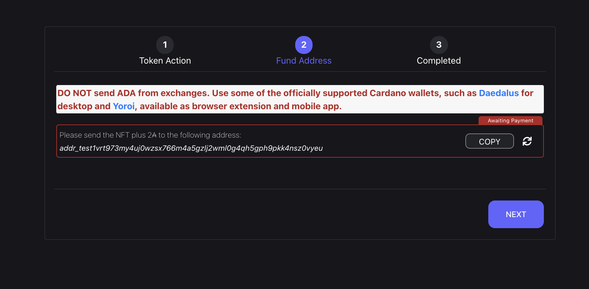

# Create new token flow

## Step 1

In step one of create token flow we give basic info about our token.

## Step 2

In step two of our create new token flow we have choose what will happen with our newly created token. We can choose between three options.

### Option 1

Option 1 is to send token to ourself. In that case it wont end on the marketplace.

### Option 2

Option two is to list newly created token for fixed price. In that case we only pick buy-out price that will buyer have to match in order to buy token.

### Option 3

Option three is to sell token on a auction. In that case we can pick starting price (Minimum bid) and buy-out price (Buy now price).

We can also pick date when our auction will start and or end.

## Step 3

Step three is to fund our address from wallet. In that case we copy address that is given to us and send ada directly from wallet. Color of wallet border will change based on payment status. When the token is minting it will have yellowish border and when token has been minted it will turn green.

Once when border turns green we can proceed with fourth step.

## Step 4

Step four is last step in our create new token flow. Here we're presented with options to either go to home screen, create another token or view our newly created token.

# Sell existing token flow

## Step 1

Similar to second step in our create new flow, in our sell existing flow we have two options.

### Option 1

Option one is to list our token for fixed price. In that case we only pick buy-out price that will buyer have to match in order to buy token.

### Option 2

Option three is to sell token on a auction. In that case we can pick starting price (Minimum bid) and buy-out price (Buy now price).

We can also pick date when our auction will start and or end.

## Step 2

Step 2 is similar to step 2 in create new token flow. Only difference here is that we send NFT together with ADA from our wallet instead of just sending ADA.

Rest of the behaviour is the same (color changing based upon status, etc.)

## Step 3

Step 3 is indentical to step 4 in our create new token flow. We're presenting user with couple of actions.

# Invest

On invest page we can find invest calculation form. This form will inform user about current token price, current supply and tokens that they will get for amount of ADA they are looking to invest.

After calculation user can copy our address, and send some ADA amount and expect our CBLU tokens in return. Amount of ADA they will send is totaly upon user. Invest form is only there to inform user by calculating amount of CBLU tokens they will recieve for some ADA amount.

